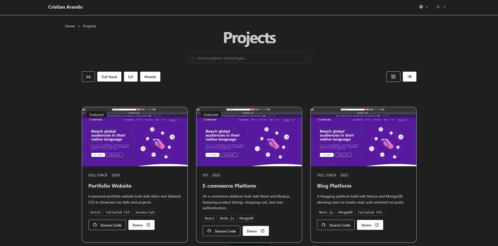

# Portfolio Website - Cristian Arando


Welcome to my portfolio website! This project showcases my skills, experience, and projects as a Full Stack Developer. Built with modern web technologies, it serves as a platform to share my work, blog posts, and certifications.

## 🌟 Features

- **Multilingual Support**: English and Spanish versions available.
- **Dynamic Content**: Projects, blog posts, and certifications are dynamically rendered.
- **Responsive Design**: Optimized for desktop and mobile devices.
- **Interactive Animations**: Smooth transitions powered by GSAP.
- **SEO Optimized**: Metadata and sitemap integration for better visibility.

## 🛠️ Technologies Used

- **Astro**: Static site generator for fast and modern web development.
- **Tailwind CSS**: Utility-first CSS framework for styling.
- **React**: Interactive components and dynamic functionality.
- **GSAP**: Animation library for creating engaging user experiences.
- **DaisyUI**: Tailwind-based UI components for consistent design.
- **TypeScript**: Strongly typed JavaScript for better maintainability.
- **i18n**: Internationalization for multilingual support.

## 📂 Project Structure

```text
/
├── public/                # Static assets (images, icons, etc.)
├── src/
│   ├── assets/            # Project-specific assets
│   ├── components/        # Reusable UI components
│   ├── content/           # Blog posts and dynamic content
│   ├── layouts/           # Page layouts
│   ├── pages/             # Website pages
│   ├── i18n/              # Internationalization files
│   └── utils/             # Utility functions
├── .astro/                # Astro configuration files
├── package.json           # Project dependencies and scripts
└── README.md              # Project documentation
```

## 🚀 Getting Started

Follow these steps to run the project locally:

1. Clone the repository:
   ```sh
   git clone https://github.com/iamcristian/portfolio-website.git
   ```
2. Navigate to the project directory:
   ```sh
   cd portfolio-website
   ```
3. Install dependencies:
   ```sh
   npm install
   ```
4. Start the development server:
   ```sh
   npm run dev
   ```
5. Open your browser and visit `http://localhost:4321`.

## 🧾 Key Sections

### Projects
Explore my featured projects, including full-stack applications, frontend designs, and more.

)

### Blog
Read articles about web development, programming, and personal growth.


### Certifications
View my certifications in software development, security, and methodologies.

### About Me
Learn more about my background, skills, and interests.

## 📜 License

This project is licensed under the MIT License. See the [LICENSE](LICENSE) file for details.

## 📬 Contact

Feel free to reach out to me:

- **Email**: crisarandosyse@gmail.com
- **GitHub**: [iamcristian](https://github.com/iamcristian)
- **LinkedIn**: [Cristian Arando](https://linkedin.com/in/cristianarando)

---
Thank you for visiting my portfolio!