## 🎯 ¿Qué es Clean Code?

> **"Código Limpio es aquel que se ha escrito con la intención de que otra persona (o tú mismo en el futuro) lo entienda"**  
> — *Robert C. Martin ("Uncle Bob")*

**Clean Code** (Código Limpio) es una **filosofía de desarrollo** que busca crear software que sea:

- ✅ **Fácil de leer** y comprender
- ✅ **Simple de mantener** y modificar  
- ✅ **Robusto** y tolerante a errores
- ✅ **Expresivo** y autoexplicativo
- ✅ **Testeable** y confiable

> ⚠️ **Importante**: No se trata solo de que el código **funcione**, sino de que sea **elegante, expresivo y profesional**.

### 🏆 Características del Código Limpio

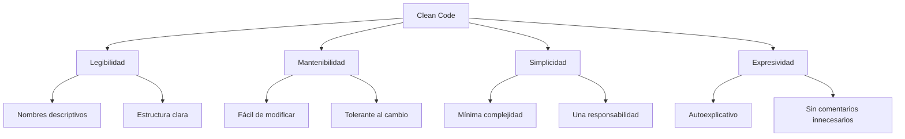

---

## 💰 El Coste del Software

El desarrollo de software implica **costes ocultos** que muchas veces no consideramos en la planificación inicial. Entender estos costes es fundamental para valorar la importancia del Clean Code.

### 📊 Fórmula del Coste Total

```
💡 Coste Total = Coste de Desarrollo + Coste de Mantenimiento

📈 Coste de Mantenimiento = Coste de Entender + Coste de Cambiar + Coste de Probar + Coste de Desplegar
```

### 📈 Estadísticas Importantes

> 📊 **Dato Crítico**: El coste de mantenimiento puede llegar a representar entre el **60% y 80%** del coste total del software durante su ciclo de vida.

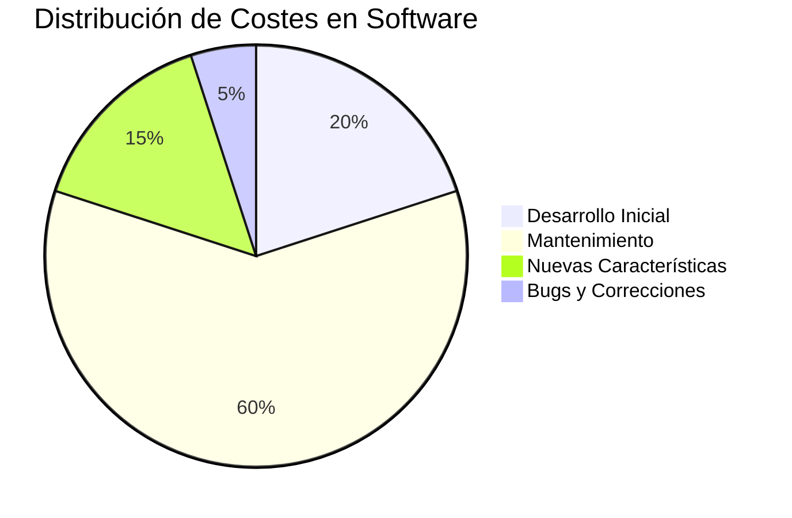

### 🔄 Ciclo de Vida del Software

| Fase | % del Coste Total | Actividades Principales |
|------|-------------------|-------------------------|
| **Desarrollo** | 20-40% | Diseño, codificación, testing inicial |
| **Mantenimiento** | 60-80% | Corrección de bugs, nuevas funcionalidades |
| **Evolución** | Variable | Refactoring, modernización |

> ⚡ **Insight**: Un código bien escrito desde el inicio puede **reducir hasta un 40%** los costes de mantenimiento.

---

## 💳 Deuda Técnica

La **deuda técnica** es uno de los conceptos más importantes en el desarrollo de software moderno. Funciona exactamente como una deuda financiera: tiene un **principal** y genera **intereses** que se acumulan con el tiempo.

> 🏦 **Analogía Bancaria**: Al igual que un préstamo bancario, la deuda técnica requiere pagos periódicos (refactoring) y, si no se paga, los intereses se acumulan exponencialmente.

### 📊 Matriz de Deuda Técnica (Martin Fowler)

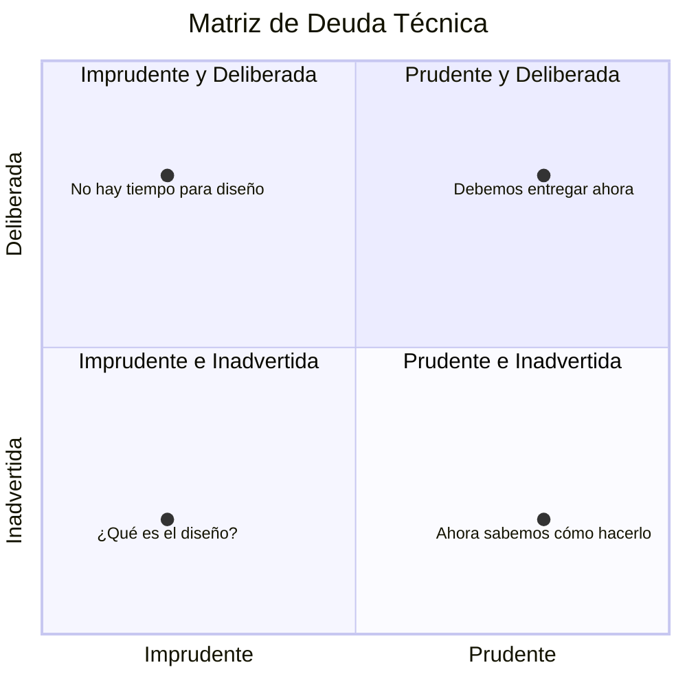

### 🚨 Tipos de Deuda Técnica

#### 1. 🔴 Deuda Imprudente y Deliberada
**Mentalidad**: *"No tenemos tiempo para hacer diseño"*

- ❌ **Riesgo**: Muy alto
- ⏰ **Urgencia de pago**: Inmediata
- 💡 **Origen**: Presión de tiempo mal gestionada
- 🎯 **Solución**: Planificación realista y comunicación con stakeholders

```typescript
// ❌ Ejemplo de deuda imprudente y deliberada
function processUser(data: any) {
    // TODO: Validar datos (lo haremos después)
    // TODO: Manejar errores (no hay tiempo)
    return data.name + " - " + data.email; // Concatenación directa
}
```

> ⚠️ **Peligro**: Esta deuda puede llevar a un proyecto al fracaso total.

#### 2. 🟠 Deuda Imprudente e Inadvertida
**Mentalidad**: *"¿Qué es el diseño de software?"*

- ❌ **Riesgo**: Extremadamente alto
- 📚 **Origen**: Falta de conocimiento técnico
- 👥 **Común en**: Desarrolladores júnior o "falsos seniors"
- 🎯 **Solución**: Formación continua y mentoring

```typescript
// ❌ Ejemplo de deuda por desconocimiento
class UserManager {
    // Viola múltiples principios SOLID sin saberlo
    saveUserToDatabase(user: any) { /* ... */ }
    sendEmailToUser(user: any) { /* ... */ }
    validateUserCredentials(user: any) { /* ... */ }
    generateUserReport(user: any) { /* ... */ }
    logUserActivity(user: any) { /* ... */ }
}
```

> 🚨 **Crítico**: Es la más peligrosa porque se genera sin consciencia del problema.

#### 3. 🟡 Deuda Prudente y Deliberada
**Mentalidad**: *"Debemos entregar ahora y lidiar con las consecuencias"*

- ⚠️ **Riesgo**: Moderado (si se paga pronto)
- 📅 **Característica**: Planificada y documentada
- 🎯 **Uso válido**: Deadlines críticos, MVP, proof of concepts
- ⏰ **Requisito**: Plan de pago establecido

```typescript
// ⚠️ Ejemplo de deuda prudente y deliberada
class PaymentProcessor {
    // DEBT: Implementación simple para MVP
    // TODO: Añadir validaciones robustas en v2.0
    // TODO: Implementar retry logic
    // JIRA: PAY-123 - Deadline: Sprint 3
    processPayment(amount: number): boolean {
        return amount > 0; // Validación mínima por deadline
    }
}
```

> ✅ **Recomendación**: Documentar siempre con tickets/issues y fechas límite.

#### 4. 🟢 Deuda Prudente e Inadvertida
**Mentalidad**: *"Ahora sabemos cómo deberíamos haberlo hecho"*

- ✅ **Riesgo**: Bajo
- 🎓 **Origen**: Aprendizaje y evolución natural
- 🔄 **Naturaleza**: Inevitable en proyectos largos
- 🎯 **Gestión**: Evaluación periódica y refactoring gradual

```typescript
// ✅ Ejemplo de deuda por aprendizaje
class UserService {
    // Versión inicial - funcional pero mejorable
    getUsers(): User[] {
        return this.database.query("SELECT * FROM users");
    }
    
    // LEARNING: Descubrimos que necesitamos paginación
    // IMPROVEMENT: Implementar Repository pattern
    // ESTIMATED_EFFORT: 2 story points
}
```

> 💡 **Normal**: Es parte natural del crecimiento y aprendizaje del equipo.

### 🔧 Refactoring: Cómo Pagar la Deuda

> **"Refactoring is a disciplined technique for restructuring an existing body of code, altering its internal structure without changing its external behavior"**  
> — *Martin Fowler*

El **refactoring** es el proceso sistemático para **mejorar el código** sin alterar su comportamiento externo, haciéndolo más entendible y tolerante a cambios.

#### 🛡️ Requisitos OBLIGATORIOS para Refactorizar

> ⚠️ **CRÍTICO**: Nunca refactorices sin tests. Es como operar sin anestesia.

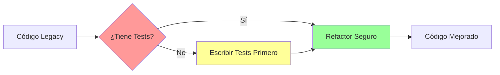

1. **🧪 Tests Automáticos**: Unitarios, integración o end-to-end
2. **📊 Cobertura Adecuada**: Mínimo 70% en funcionalidad crítica
3. **🔄 CI/CD Pipeline**: Ejecución automática de tests
4. **👥 Code Review**: Validación por pares

#### ⏰ ¿Cuándo Refactorizar?

**Red Flag Indicators** 🚩:

| Indicador | Descripción | Acción |
|-----------|-------------|---------|
| 🔄 **Rule of Three** | Duplicaste código 3+ veces | Extraer función/clase |
| 🐛 **Bug Fixes Frecuentes** | Misma área problemática | Refactor estructural |
| ⏱️ **Cambios Lentos** | Modificaciones simples toman mucho tiempo | Simplificar diseño |
| 😵 **Cognitive Overload** | Difícil de entender después de 1 semana | Clarificar nombres y estructura |
| 🧪 **Tests Difíciles** | Complicado escribir unit tests | Desacoplar dependencias |

#### 📋 Las 4 Reglas del Diseño Simple (Kent Beck)

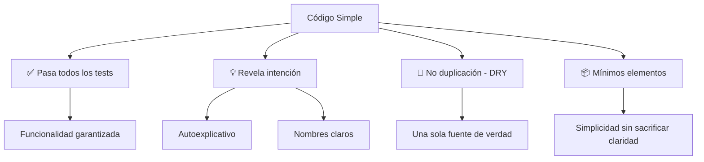

1. **✅ El código pasa todos los tests** → Funcionalidad garantizada
2. **💡 Revela la intención del diseño** → Es autoexplicativo
3. **🔄 Respeta el principio DRY** → No hay duplicación innecesaria
4. **📦 Tiene el menor número posible de elementos** → Simplicidad sin sacrificar claridad

#### 🎯 Estrategias de Refactoring

##### 🥄 Técnica del "Boy Scout"
> *"Deja el código un poco mejor de como lo encontraste"*

```typescript
// ❌ Antes del refactor
function calc(a: any, b: any): any {
    return a + b;
}

// ✅ Después del refactor (Boy Scout)
function calculateSum(firstNumber: number, secondNumber: number): number {
    return firstNumber + secondNumber;
}
```

##### 🍅 Técnica Pomodoro para Refactoring
- **25 min**: Refactor enfocado
- **5 min**: Break + run tests
- **4 pomodoros**: Review completo del cambio

##### 🎯 Refactoring por Capas
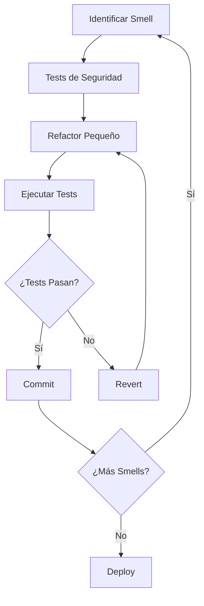

---

## 📖 SECCIÓN I: Fundamentos del Clean Code

### 🏷️ Variables y Nombres

> **"Nuestro código tiene que ser simple y directo, debería leerse con la misma facilidad que un texto bien escrito"**  
> — *Grady Booch*

El **naming** (nomenclatura) es **el 80%** del clean code. Un buen nombre puede hacer la diferencia entre código que necesita comentarios y código autoexplicativo.

#### 🎯 Principios Fundamentales para Buenos Nombres

##### 1. 🗣️ Nombres Pronunciables y Expresivos

Los nombres deben poder **pronunciarse en una conversación** sin dificultad.

```typescript
// ❌ Imposible de pronunciar
const dtMgr = new DataManager();
const usrMgr = new UserManager();
const pwdCfg = { min: 8, max: 20 };

// ✅ Pronunciable y claro
const dataManager = new DataManager();
const userManager = new UserManager();
const passwordConfig = { minLength: 8, maxLength: 20 };
```

**Reglas de Pronunciabilidad**:
- ✅ Usa **CamelCase** consistentemente
- ✅ Evita abreviaciones que no sean **universales**
- ✅ Si necesitas explicar una abreviación, **no la uses**

##### 2. 📝 Uso Correcto de var, let y const

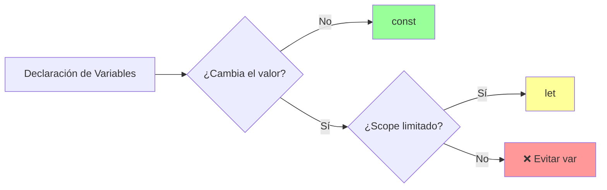

```typescript
// ❌ Problemas de scope con var
var isActive = true;
if (isActive) {
    var userName = 'Juan'; // Se filtra fuera del bloque
}
console.log(userName); // 'Juan' - problema de scope

// ✅ Uso correcto
const isActive = true; // No cambiará
let userName = ''; // Puede cambiar

if (isActive) {
    userName = 'Juan'; // Scope correcto
}
```

**Mejores Prácticas**:
- 🟢 **const**: Para valores inmutables (80% de los casos)
- 🟡 **let**: Para variables que van a cambiar (20% de los casos)  
- 🔴 **var**: Nunca (0% de los casos en código moderno)

##### 3. 🚫 Ausencia de Información Técnica

Evita **notación húngara** y detalles técnicos innecesarios en nombres de negocio.

```typescript
// ❌ Información técnica innecesaria
class AbstractUserRepositoryImpl {
    private strUserName: string;
    private arrUserRoles: string[];
    private objUserConfig: object;
    private boolIsActive: boolean;
}

// ✅ Enfocado en el dominio
class UserRepository {
    private name: string;
    private roles: string[];
    private configuration: UserConfig;
    private isActive: boolean;
}
```

> ⚠️ **Excepción**: En librerías de propósito general o desarrollo horizontal, la información técnica puede ser relevante.

##### 4. 📚 Léxico Coherente

**Principio de Consistencia**: Usa el mismo vocabulario para el mismo concepto en todo el proyecto.

```typescript
// ❌ Inconsistente - mismo concepto, diferentes nombres
getUserInfo();
getClientData();
getCustomerRecord();
retrievePersonDetails();

// ✅ Coherente - mismo concepto, mismo nombre
getUser();
getClient();  // Si es diferente de User
getCustomer(); // Si es diferente de User

// ✅ O mejor aún, si son el mismo concepto
getUser();
updateUser();
deleteUser();
createUser();
```

**Diccionario de Proyecto**: Mantén un glosario de términos del dominio.

| Concepto | Término Unificado | ❌ Evitar |
|----------|-------------------|-----------|
| Usuario del sistema | `User` | `Client`, `Customer`, `Person` |
| Configuración | `Configuration` | `Config`, `Settings`, `Options` |
| Validación | `Validation` | `Check`, `Verify`, `Validate` |

##### 5. 📊 Nombres Según el Tipo de Datos

###### 📋 Arrays - Pluralización Inteligente

```typescript
// ❌ Confuso
const fruit = ['manzana', 'platano', 'fresa']; // ¿Es uno o muchos?
const data = [1, 2, 3, 4, 5]; // ¿Qué tipo de datos?

// ⚠️ Redundante
const fruitList = ['manzana', 'platano', 'fresa']; // "List" es obvio

// ✅ Claro y específico
const fruits = ['manzana', 'platano', 'fresa'];
const availableFruits = ['manzana', 'fresa'];
const selectedFruits = ['manzana'];
const userIds = [1, 2, 3, 4, 5];
const activeUserIds = [1, 3, 5];
```

**Patrones de Naming para Arrays**:
```typescript
// ✅ Patrones recomendados
const users = getAllUsers();           // Todos los usuarios
const activeUsers = getActiveUsers();  // Subconjunto específico
const userNames = users.map(u => u.name); // Proyección de propiedad
const sortedUsers = users.sort(...);  // Resultado de operación
```

###### ✅ Booleanos - Prefijos Descriptivos

Los prefijos **is**, **has**, **can**, **should**, **was** ayudan a inferir inmediatamente el tipo y propósito.

```typescript
// ❌ Ambiguo
const open = true;        // ¿Está abierto? ¿Se puede abrir?
const write = true;       // ¿Está escribiendo? ¿Puede escribir?
const user = true;        // ¿Qué significa esto?

// ✅ Autodocumentado
const isOpen = true;           // Estado actual
const canWrite = true;         // Capacidad/permiso
const hasPermissions = true;   // Posesión
const shouldValidate = true;   // Recomendación/regla
const wasProcessed = false;    // Estado histórico
const willExpire = true;       // Estado futuro
```

**Tabla de Prefijos para Booleanos**:

| Prefijo | Uso | Ejemplo |
|---------|-----|---------|
| `is` | **Estado actual** | `isActive`, `isVisible`, `isLoading` |
| `has` | **Posesión/Existencia** | `hasPermission`, `hasChildren`, `hasErrors` |
| `can` | **Capacidad/Permiso** | `canEdit`, `canDelete`, `canAccess` |
| `should` | **Recomendación/Regla** | `shouldValidate`, `shouldRetry`, `shouldCache` |
| `was` | **Estado pasado** | `wasSuccessful`, `wasModified`, `wasDeleted` |
| `will` | **Estado futuro** | `willExpire`, `willUpdate`, `willBeRemoved` |

###### 🔢 Números - Palabras Descriptivas

```typescript
// ❌ Sin contexto
const fruits = 3;        // ¿Cantidad? ¿Índice? ¿ID?
const users = 50;        // ¿Total? ¿Máximo? ¿Activos?
const timeout = 5000;    // ¿Milisegundos? ¿Segundos?

// ✅ Con contexto claro
const totalFruits = 3;
const maxFruits = 5;
const minFruits = 1;
const fruitCount = 3;
const currentFruitIndex = 0;
const nextFruitId = 4;

const activeUserCount = 50;
const maxConcurrentUsers = 100;
const userSessionsToday = 50;

const timeoutInMilliseconds = 5000;
const retryDelayInSeconds = 5;
const cacheExpirationInMinutes = 30;
```

**Patrones para Números**:
```typescript
// ✅ Contadores
const userCount = users.length;
const totalItems = items.length;
const errorCount = errors.length;

// ✅ Límites y rangos
const minAge = 18;
const maxAge = 65;
const defaultPageSize = 20;
const maxRetries = 3;

// ✅ Índices y posiciones
const currentIndex = 0;
const lastIndex = items.length - 1;
const selectedIndex = 2;

// ✅ Tiempos (siempre especificar unidad)
const delayInMs = 1000;
const timeoutInSeconds = 30;
const intervalInMinutes = 15;
```

###### 🚀 Funciones - Verbos + Sustantivos

Las funciones representan **acciones**, por lo que deben comenzar con un **verbo** seguido de un **sustantivo**.

```typescript
// ❌ Demasiado específicos - lógica condicional en el nombre
createUserIfNotExists();
updateUserIfNotEmpty();
sendEmailIfFieldsValid();
deleteProductIfInactive();

// ✅ Claros y simples - la lógica condicional va dentro
createUser();           // La función decide si debe crear o no
updateUser();           // La función valida internamente
sendEmail();            // La función verifica prerequisitos
deleteProduct();        // La función maneja las condiciones

// ✅ Funciones de acceso, modificación y predicado
// Acceso
getUser();
getUserById();
findUserByEmail();

// Modificación
setUserRole();
updateUserStatus();
deleteUserAccount();

// Predicados (preguntas que devuelven boolean)
isValidUser();
hasPermission();
canAccess();
shouldRetry();
```

**Categorías de Verbos por Propósito**:

```typescript
// 🔍 CONSULTA (no modifican estado)
get*()     // Obtener algo existente (puede fallar si no existe)
find*()    // Buscar algo (puede no encontrar)
search*()  // Búsqueda con criterios
list*()    // Obtener colección
count*()   // Contar elementos

// ✏️ MODIFICACIÓN (cambian estado)
create*()  // Crear nuevo elemento
update*()  // Modificar elemento existente
delete*()  // Eliminar elemento
set*()     // Establecer valor
add*()     // Añadir a colección
remove*()  // Quitar de colección

// ❓ PREDICADOS (devuelven boolean)
is*()      // Verificar estado
has*()     // Verificar posesión
can*()     // Verificar capacidad
should*()  // Verificar recomendación

// 🔄 PROCESAMIENTO (realizan operaciones)
process*() // Procesar datos
transform*() // Transformar formato
validate*() // Verificar validez
calculate*() // Realizar cálculos
```

###### 🏛️ Clases - Sustantivos del Dominio

Las clases representan **entidades**, **conceptos** o **servicios** del dominio.

```typescript
// ❌ Nombres genéricos sin significado
class Data { }           // ¿Qué datos?
class Info { }           // ¿Qué información?
class Manager { }        // ¿Gestiona qué?
class Processor { }      // ¿Procesa qué?
class Handler { }        // ¿Maneja qué?
class Util { }           // ¿Utilidad para qué?

// ✅ Específicos del dominio de negocio
class User { }
class Product { }
class Order { }
class PaymentMethod { }

// ✅ Servicios con propósito claro
class UserRepository { }      // Persistencia de usuarios
class EmailService { }        // Servicio de emails
class PaymentProcessor { }    // Procesamiento de pagos
class OrderValidator { }      // Validación de pedidos
class PriceCalculator { }     // Cálculo de precios

// ✅ Patrones arquitectónicos reconocidos
class UserController { }      // API endpoints
class ProductFactory { }      // Creación de productos
class OrderBuilder { }        // Construcción compleja
class NotificationObserver { } // Observer pattern
```

**Patrones de Naming para Clases**:

| Propósito | Patrón | Ejemplo |
|-----------|--------|---------|
| **Entidades de Dominio** | `Sustantivo` | `User`, `Product`, `Order` |
| **Repositorios** | `*Repository` | `UserRepository`, `ProductRepository` |
| **Servicios** | `*Service` | `EmailService`, `PaymentService` |
| **Controladores** | `*Controller` | `UserController`, `ApiController` |
| **Factorías** | `*Factory` | `UserFactory`, `ConnectionFactory` |
| **Builders** | `*Builder` | `QueryBuilder`, `ReportBuilder` |
| **Validadores** | `*Validator` | `EmailValidator`, `FormValidator` |
| **Calculadoras** | `*Calculator` | `PriceCalculator`, `TaxCalculator` |

## Funciones
>“Sabemos que estamos desarrollando código limpio cuando cada función hace exactamente lo que su nombre indica”. – Ward Cunningham³⁶

### Funciones

> "Sabemos que estamos desarrollando código limpio cuando cada función hace exactamente lo que su nombre indica" - Ward Cunningham

Las funciones son los bloques de construcción fundamentales de cualquier programa. Una función bien escrita debe ser pequeña, hacer una sola cosa y hacerla bien.

#### Principios para Funciones Limpias

##### 1. Tamaño Reducido
Las funciones deben tener un tamaño reducido. Idealmente:
- **4-5 líneas** para funciones muy simples  
- **15-20 líneas** como máximo para funciones más complejas
- Si una función es más larga, probablemente está haciendo demasiadas cosas

##### 2. Número de Argumentos
**Límite**: Máximo 3 parámetros. Si necesitas más, considera usar un objeto.
```ts
// bad
function createMenu(title, body, buttonText, cancellable) {
// ...
}

// better
function createMenu({ title, body, buttonText, cancellable }) {
// ...
}

createMenu({
	title: 'Foo',
	body: 'Bar',
	buttonText: 'Baz',
	cancellable: true
});
```

### Estilo declarativo frente al imperativo
```ts
const orders = [
	{ productTitle: "Product 1", amount: 10 },
	{ productTitle: "Product 2", amount: 30 },
	{ productTitle: "Product 3", amount: 20 },
	{ productTitle: "Product 4", amount: 60 }
];

//worse
function imperative(){
  let totalAmount = 0;

  for (let i = 0; i < orders.length; i++) {
    totalAmount += orders[i].amount;
  }

  console.log(totalAmount); // 120
}

//better
function declarative(){
  function sumAmount(currentAmount, order){
    return currentAmount + order.amount;
  }

  function getTotalAmount(orders) {
    return orders.reduce(sumAmount, 0);
  }

 console.log(getTotalAmount(orders)); // 120
}

```

#### 🎭 Funciones Anónimas: Cuándo Usar y Cuándo Evitar

> **Principio**: A veces la mejor forma de escoger un buen nombre es no hacerlo.

Las funciones anónimas están **justificadas** cuando:

1. ✅ **Son muy simples** → Una línea de lógica evidente
2. ✅ **Se usan una sola vez** → No hay reutilización
3. ✅ **El contexto es claro** → Se entiende qué hacen por el lugar donde se usan

```typescript
function processUsers() {
    const users = [
        { isEnabled: true, name: 'Ana', role: 'admin' },
        { isEnabled: false, name: 'Luis', role: 'user' },
        { isEnabled: true, name: 'María', role: 'user' },
    ];

    // ✅ Función anónima justificada - predicado simple y contexto claro
    const enabledUsers = users.filter(user => user.isEnabled);
    const userNames = users.map(user => user.name);
    const adminUsers = users.filter(user => user.role === 'admin');
    
    return { enabledUsers, userNames, adminUsers };
}
```

**Cuándo NO usar funciones anónimas**:

```typescript
// ❌ Lógica compleja en función anónima
const processedUsers = users.filter(user => {
    const hasValidEmail = user.email && user.email.includes('@');
    const hasRequiredRole = ['admin', 'moderator'].includes(user.role);
    const isNotExpired = user.expirationDate > new Date();
    return hasValidEmail && hasRequiredRole && isNotExpired;
});

// ✅ Extraer función con nombre descriptivo
const isValidActiveUser = (user: User): boolean => {
    const hasValidEmail = user.email && user.email.includes('@');
    const hasRequiredRole = ['admin', 'moderator'].includes(user.role);
    const isNotExpired = user.expirationDate > new Date();
    return hasValidEmail && hasRequiredRole && isNotExpired;
};

const processedUsers = users.filter(isValidActiveUser);
```

#### 🔍 Transparencia Referencial

> **Definición**: Una función es **referencialmente transparente** si puede ser reemplazada por su valor de retorno sin cambiar el comportamiento del programa.

**Características de una función transparente**:
- 🎯 **Determinista**: Mismos inputs → Mismos outputs
- 🚫 **Sin efectos secundarios**: No modifica estado externo
- 🔒 **No depende de estado externo mutable**: Solo de sus parámetros

```typescript
// ❌ SIN transparencia referencial
let globalCounter = 0;

function increaseCounterBad(value: number): number {
    globalCounter += value; // ¡Efecto secundario!
    console.log('Counter updated'); // ¡Otro efecto secundario!
    return globalCounter;
}

// El resultado cambia aunque los parámetros sean iguales
console.log(increaseCounterBad(5)); // 5
console.log(increaseCounterBad(5)); // 10 (¡diferente resultado!)

// ✅ CON transparencia referencial
function increaseCounterGood(currentValue: number, increment: number): number {
    return currentValue + increment; // Función pura
}

// El resultado es siempre predecible
console.log(increaseCounterGood(10, 5)); // 15
console.log(increaseCounterGood(10, 5)); // 15 (mismo resultado)
```

**Beneficios de la Transparencia Referencial**:

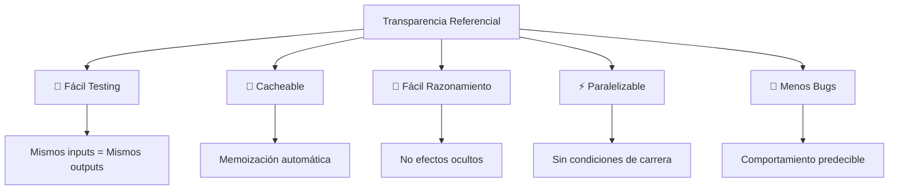

```typescript
// ✅ Ejemplo completo de funciones transparentes
interface User {
    id: number;
    name: string;
    email: string;
    age: number;
}

// ✅ Función pura - Transparencia referencial
function calculateUserDiscount(age: number, baseAmount: number): number {
    if (age >= 65) return baseAmount * 0.8; // 20% descuento seniors
    if (age <= 18) return baseAmount * 0.9; // 10% descuento jóvenes
    return baseAmount;
}

// ✅ Función pura - Filtrado sin efectos secundarios
function filterAdultUsers(users: User[]): User[] {
    return users.filter(user => user.age >= 18);
}

// ✅ Función pura - Transformación sin mutación
function addDiscountToUsers(users: User[], baseAmount: number): (User & { discount: number })[] {
    return users.map(user => ({
        ...user,
        discount: calculateUserDiscount(user.age, baseAmount)
    }));
}

// ✅ Uso composable y predecible
function processUserDiscounts(users: User[], baseAmount: number) {
    const adultUsers = filterAdultUsers(users);
    const usersWithDiscounts = addDiscountToUsers(adultUsers, baseAmount);
    return usersWithDiscounts;
}
```

**Testing de Funciones Transparentes**:

```typescript
// ✅ Tests simples y confiables para funciones puras
describe('calculateUserDiscount', () => {
    it('should give 20% discount for seniors', () => {
        expect(calculateUserDiscount(70, 100)).toBe(80);
    });
    
    it('should give 10% discount for minors', () => {
        expect(calculateUserDiscount(16, 100)).toBe(90);
    });
    
    it('should give no discount for adults', () => {
        expect(calculateUserDiscount(30, 100)).toBe(100);
    });
    
    // No necesitamos mocks, spies, o setup complejo
    // porque la función es predecible y aislada
});
```

#### 🔄 Principio DRY (Don't Repeat Yourself)

> **"Every piece of knowledge must have a single, unambiguous, authoritative representation within a system"**  
> — *The Pragmatic Programmer*

**DRY** significa "No te repitas" - **evita la duplicación de código** de manera inteligente.

##### 🎯 Beneficios del Principio DRY

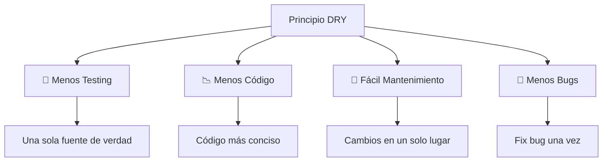

- ✅ **Evita** testear la misma lógica múltiples veces
- ✅ **Reduce** la cantidad total de código
- ✅ **Facilita** el mantenimiento y modificaciones
- ✅ **Minimiza** la posibilidad de bugs por inconsistencias

> **🔑 Regla de Oro**: Si necesitas cambiar la misma lógica en múltiples lugares, estás violando DRY.

##### 📊 Tipos de Duplicación

###### 1. 🔴 Duplicación Real (ELIMINAR)
El código es **idéntico** Y cumple la **misma función**.

```typescript
// ❌ Duplicación real - misma lógica, mismo propósito
function validateUserEmail(email: string): boolean {
    if (!email) return false;
    if (!email.includes('@')) return false;
    if (email.length < 5) return false;
    return true;
}

function validateAdminEmail(email: string): boolean {
    if (!email) return false;         // ¡Duplicado!
    if (!email.includes('@')) return false;  // ¡Duplicado!
    if (email.length < 5) return false;      // ¡Duplicado!
    return true;
}

// ✅ DRY aplicado - una sola función
function validateEmail(email: string): boolean {
    if (!email) return false;
    if (!email.includes('@')) return false;
    if (email.length < 5) return false;
    return true;
}

function validateUserEmail(email: string): boolean {
    return validateEmail(email);
}

function validateAdminEmail(email: string): boolean {
    return validateEmail(email) && email.endsWith('@company.com');
}
```

###### 2. 🟡 Duplicación Accidental (NO UNIFICAR)
El código **parece similar** pero cumple **funciones distintas**.

```typescript
// ⚠️ Duplicación accidental - similar pero diferente propósito
function formatUserDisplayName(user: User): string {
    return `${user.firstName} ${user.lastName}`;
}

function formatUserFullName(user: User): string {
    return `${user.firstName} ${user.lastName}`;
}

// 🤔 ¿Parecen iguales? Pero tienen propósitos diferentes:
// - formatUserDisplayName: Para mostrar en UI (puede cambiar con i18n)
// - formatUserFullName: Para documentos oficiales (formato legal)

// ✅ Mejor mantenerlas separadas - pueden evolucionar diferente
function formatUserDisplayName(user: User): string {
    // Puede incluir lógica de localización en el futuro
    return `${user.firstName} ${user.lastName}`;
}

function formatUserFullName(user: User): string {
    // Formato legal que incluye middle name si existe
    const middle = user.middleName ? ` ${user.middleName}` : '';
    return `${user.firstName}${middle} ${user.lastName}`;
}
```

##### 💡 Aplicando DRY Correctamente

**Ejemplo Completo: Sistema de Reportes**

```typescript
interface ReportData {
    name: string;
    createdAt: Date;
    purchases: number;
    conversionRate: number;
}

const reportData: ReportData = {
    name: "Software Crafters",
    createdAt: new Date(),
    purchases: 100,
    conversionRate: 10.5,
};

// ❌ Violando DRY - código duplicado
function badReportSystem() {
    function showReport(data: ReportData): void {
        // Formato duplicado
        const reportFormatted = `
📊 REPORT SUMMARY
Name: ${data.name}
Created: ${data.createdAt.toLocaleDateString()}
Purchases: ${data.purchases}
Conversion Rate: ${data.conversionRate}%
---`;
        console.log("📺 Showing report on screen:", reportFormatted);
    }

    function saveReport(data: ReportData): void {
        // ¡Código duplicado!
        const reportFormatted = `
📊 REPORT SUMMARY
Name: ${data.name}
Created: ${data.createdAt.toLocaleDateString()}
Purchases: ${data.purchases}
Conversion Rate: ${data.conversionRate}%
---`;
        console.log("💾 Saving report to file:", reportFormatted);
    }

    function emailReport(data: ReportData): void {
        // ¡Más código duplicado!
        const reportFormatted = `
📊 REPORT SUMMARY
Name: ${data.name}
Created: ${data.createdAt.toLocaleDateString()}
Purchases: ${data.purchases}
Conversion Rate: ${data.conversionRate}%
---`;
        console.log("📧 Emailing report:", reportFormatted);
    }

    showReport(reportData);
    saveReport(reportData);
    emailReport(reportData);
}

// ✅ Aplicando DRY - una sola fuente de verdad
function goodReportSystem() {
    // 🎯 Función especializada para formateo
    function formatReport(data: ReportData): string {
        return `
📊 REPORT SUMMARY
Name: ${data.name}
Created: ${data.createdAt.toLocaleDateString()}
Purchases: ${data.purchases}
Conversion Rate: ${data.conversionRate}%
---`;
    }

    // 🎯 Funciones especializadas para cada acción
    function showReport(data: ReportData): void {
        console.log("📺 Showing report on screen:", formatReport(data));
    }

    function saveReport(data: ReportData): void {
        console.log("💾 Saving report to file:", formatReport(data));
    }

    function emailReport(data: ReportData): void {
        console.log("📧 Emailing report:", formatReport(data));
    }

    showReport(reportData);
    saveReport(reportData);
    emailReport(reportData);
}

// ✅ Versión avanzada con configurabilidad
function advancedReportSystem() {
    enum ReportFormat {
        SUMMARY = 'summary',
        DETAILED = 'detailed',
        COMPACT = 'compact'
    }

    function formatReport(data: ReportData, format: ReportFormat = ReportFormat.SUMMARY): string {
        const baseInfo = {
            name: data.name,
            created: data.createdAt.toLocaleDateString(),
            purchases: data.purchases,
            conversionRate: data.conversionRate
        };

        switch (format) {
            case ReportFormat.COMPACT:
                return `${baseInfo.name}: ${baseInfo.purchases} purchases (${baseInfo.conversionRate}%)`;
                
            case ReportFormat.DETAILED:
                return `
📊 DETAILED REPORT
==================
Company: ${baseInfo.name}
Date Created: ${baseInfo.created}
Total Purchases: ${baseInfo.purchases}
Conversion Rate: ${baseInfo.conversionRate}%
Revenue Impact: $${(baseInfo.purchases * 100).toLocaleString()}
Performance: ${baseInfo.conversionRate > 10 ? '🟢 Excellent' : '🟡 Good'}
==================`;

            default: // SUMMARY
                return `
📊 REPORT SUMMARY
Name: ${baseInfo.name}
Created: ${baseInfo.created}
Purchases: ${baseInfo.purchases}
Conversion Rate: ${baseInfo.conversionRate}%
---`;
        }
    }

    function showReport(data: ReportData, format?: ReportFormat): void {
        console.log("📺 Showing report:", formatReport(data, format));
    }

    function saveReport(data: ReportData, format?: ReportFormat): void {
        console.log("💾 Saving report:", formatReport(data, format));
    }

    function emailReport(data: ReportData, format?: ReportFormat): void {
        console.log("📧 Emailing report:", formatReport(data, format));
    }

    // Uso flexible
    showReport(reportData, ReportFormat.DETAILED);
    saveReport(reportData, ReportFormat.COMPACT);
    emailReport(reportData); // Default SUMMARY
}
```

##### 🚨 Red Flags del Anti-DRY

- 🔍 **"Magic Numbers"** repetidos
- 📝 **Textos duplicados** en múltiples lugares
- 🔄 **Lógica de validación** repetida
- 🎨 **Formateo** idéntico en diferentes funciones
- 🔧 **Configuración** hardcodeada repetida

```typescript
// ❌ Anti-DRY Red Flags
const userAge1 = 18; // Magic number
const userAge2 = 18; // Repetido
const ERROR_MSG = "Invalid email"; // Repetido en 5 lugares
const EMAIL_REGEX = /^[^\s@]+@[^\s@]+\.[^\s@]+$/; // Repetido en 3 lugares

// ✅ DRY Solution
const CONSTANTS = {
    MIN_ADULT_AGE: 18,
    ERROR_MESSAGES: {
        INVALID_EMAIL: "Invalid email format"
    },
    REGEX: {
        EMAIL: /^[^\s@]+@[^\s@]+\.[^\s@]+$/
    }
} as const;
```

## Evita el uso de comentarios:
“No comentes el código mal escrito, reescríbelo”. – Brian W. Kernighan⁴¹

la idea es que los comentarios sean la excepción, no la regla.

En todo caso, si necesitas hacer uso de los comentarios, lo importante es comentar el
porqué, más que comentar el qué o el cómo. Ya que el cómo lo vemos, es el código,
y el qué no debería ser necesario si escribes código autoexplicativo. Pero el por qué
has decidido resolver algo de cierta manera a sabiendas de que resulta extraño, eso
sí que deberías explicarlo.

## Formato coherente
“El buen código siempre parece estar escrito por alguien a quien le importa”. –
Michael Feathers⁴
- Problemas similares, soluciones simetricas

Se debe seguir los mismos patrones a la hora de resolver problemas similares dentro del mismo proyecto
Ej. Si estamos resolviendo la entidad de un CRUD de una entidad de una determinada forma, es imporante que para implementar el CRUD de otras entidades sigamos el mismo estilo

- Densidad, apertura y distancia vertical

Las líneas de código con una relación directa deben ser verticalmente densas,
mientras que las líneas que separan conceptos deben de estar separadas por espacios
en blanco. Por otro lado, los conceptos relacionados deben mantenerse próximos
entre sí.

- Lo mas importante primero

Los elementos superiores de los ficheros deben contener los conceptos y algoritmos
más importantes, e ir incrementando los detalles a medida que descendemos en el
fichero.

- Indentacion
Debemos respetar la indentacion o sangrado.

## Clases
“Si quieres ser un programador productivo esfuérzate en escribir código legible”.
– Robert C. Martin⁴³

Una clase ademas de ser una abstraccion mediante la cual representamos entidades o conceptos, es un elemento organizativo muy pontente.

### Tamano reducido
Las clases al giaul que funciones, deben tenre un tamano reducido.
1. un buen nombre -> buena forma para limitar el tamano de una clase ya que describe la responsabilidad de la clase
2. aplicar el principio de responsabilidad unica. una clase no deberia tener mas de una responsabilidad, no deberia tener mas de un motivo por el que ser modfiicada
```ts
class UserSettings {
	private user: User;
	private settings: Settings;

	constructor(user){
		this.user = user;
	}

	changeSettings(settings){
		if(this.verifyCredentials()){
			//...
		}
	}

	verifyCredentials(){
		//...
	}
}

// la clase UserSettings tiene dos responsbilidades: gestionar las settings del usuario y el manejo de las credenciales. 
// Seria mas interesante: UserAuth y UserSettings
class UserAuth{
	private user: User;

	constructor(user: User){
		this.user = user
	}

	verifyCredentials(){
		//...
	}
}

class UserSettings {
	private user: User;
	private settings: Settings;
	private auth: UserAuth;

	constructor(user: User, auth: UserAuth){
		this.user = user;
		this.auth = auth;
	}

	changeSettings(settings){
		if(this.auth.verifyCredentials()){
			//...
		}
	}
}
```

### Organizacion

Las clases deben comenzar con una lista de variables
1. constante publicas primero(si hay)
2. viarables estaticas privadas y despues las de intancia privadas
3. variables de instancia publicas
Los metodos o funciones publicas deberian ir a continaucion
4. constructor
5. fucniones estaticas de la clase y metodos privados
6. resto de metodos de nstancia ordenados de mayor a menos imporantcia
7. getters y setters

```ts
class Post{
	private title: string;
	private content: number;
	private createdAt: number;

	static create(title:string; content:string){
		return new Post(title, content)
	}

	private constructor(title:string; content:string){
		this.setTitle(title);
		this.setContent(content);
		this.createdAt = Date.now();
	}

	setTitle(title:string){
		if(StringUtils.isNullOrEmpty(title))
			throw new Error('Title cannot be empty')
			
		this.title = title;
	}

	setContent(content:string){
		if(StringUtils.isNullOrEmpty((content))
			throw new Error(‘Content cannot be empty’)

		this.content = content;
	 }

	getTitle(){
		return this.title;
	}

	getContent(){
		return this.content;
	}
}
```
### Prioriza la composicion frente a la herencia

- herencia permite definir una implementacion desde una clase padre
- composicion se basas en ensamblar objetos diferentes para obtener una funcionalidad mas compleja

Composicion sobre herencia nos ayuda a mantener cada clase encapsulada y centrada en una sola tarea (principio de responsabilidad). favoreciendo la modularidad  evitando acoplamiento de dependencias

> hay situaciones donde es preferible herencia, depende de la situacion. la clase que hereda es realmente un hijo o simplemente tiene elementos del padre?

```ts
class Employee {
	private name: string;
	private email: string;

	constructor(name:string, email:string) {
		this.name = name;
		this.email = email;
	}

 // ...
 }

 class EmployeeTaxData extends Employee {
	private ssn: string;
	private salary: number;

	constructor(ssn:string, salary:number) {
		super();
		this.ssn = ssn;
		this.salary = salary;
	}
 //...
 }

// el caso anteiore es forzado la herencia, ya que un empelado "tiene" EmployeeTaxData no "es" EmployeeTaxData. Si refactorizamos usando composicion tenemos

1 class EmployeeTaxData{
2 private ssn: string;
3 private salary: number;
4
5 constructor(ssn:string, salary:number) {
6 this.ssn = ssn;
7 this.salary = salary;
8 }
9 //...
10 }
11
12 class Employee {
13 private name: string;
14 private email: string;
15 private taxData: EmployeeTaxData;
16
17 constructor(name:string, email:string) {
18 this.name = name;
19 this.email = email;
20 }
21
22 setTaxData(taxData:EmployeeTaxData){
23 this.taxData = taxData;
24 }
25 // ...
26 }
```


## SECCIÓN II: Principios SOLID

Los principios SOLID son un conjunto de cinco principios de diseño orientado a objetos que ayudan a crear software más mantenible, flexible y comprensible.

### De STUPID a SOLID

Antes de conocer los principios SOLID, es importante reconocer los **anti-patrones STUPID** que debemos evitar:

#### STUPID (Lo que NO hacer)

- **S**ingleton → Patrón singleton
- **T**ight Coupling → Alto acoplamiento  
- **U**ntestability → Código no testeable
- **P**remature Optimization → Optimizaciones prematuras
- **I**ndescriptive Naming → Nombres poco descriptivos
- **D**uplication → Duplicidad de código

#### ¿Qué es un Code Smell?

Son **indicios** de que algo no está del todo bien planteado en nuestro código y que es probable que debamos refactorizarlo. No son bugs, sino señales de problemas de diseño.

### Análisis de Anti-patrones STUPID

#### Patrón Singleton

La intención de este patrón es garantizar que una clase tenga una única instancia y proporcionar un acceso global a ella.

```typescript
class Singleton {
    private static instance: Singleton;
    public title: string;

    constructor() {
        if (Singleton.instance) {
            return Singleton.instance;
        }

        this.title = "my singleton";
        Singleton.instance = this;
    }
}

const mySingleton = new Singleton();
const mySingleton2 = new Singleton();

console.log("Singleton 1: ", mySingleton.title);
mySingleton.title = "modified in instance 1";
console.log("Singleton 2: ", mySingleton2.title); // También muestra "modified"
```

**¿Por qué es problemático el Singleton?**

1. **Estado global mutable** - Puede ser modificado desde cualquier parte
2. **Dificulta el testing** - Los tests no son independientes entre sí
3. **Acoplamiento fuerte** - Crea dependencias ocultas
4. **Viola el principio de responsabilidad única** - Gestiona su instancia Y su lógica de negocio

**Alternativas al Singleton:**
- **Inyección de dependencias**
- **Factory patterns**
- **Módulos con exportación única** (en JavaScript/TypeScript)

#### Alto Acoplamiento (Tight Coupling)

Un alto acoplamiento entre clases dificulta la mantenibilidad y tolerancia al cambio de un proyecto software. Lo ideal es tener **acoplamiento bajo** y **buena cohesión**.

**Conceptos clave:**

- **Cohesión** → Relación entre los módulos de un sistema
  - **Alta cohesión**: Sus métodos están estrechamente relacionados entre sí (self-contained), contiene todas las piezas que necesita
  - **Riesgo**: Demasiada cohesión puede tender a crear módulos con múltiples responsabilidades

- **Acoplamiento** → Relación que guardan entre sí los módulos de un sistema y su dependencia entre ellos
  - **Alto acoplamiento**: Muchas relaciones entre módulos con muchas dependencias entre sí
  - **Bajo acoplamiento**: Los módulos son independientes → módulos más pequeños con responsabilidades definidas

> **Regla de oro**: Favorecer el bajo acoplamiento pero sin sacrificar la cohesión

#### Código No Testeable (Untestability)

Es causado por alto acoplamiento y/o cuando no se inyectan las dependencias. 

**Estrategia**: Nuestro diseño debe tener tests desde un inicio, así se consigue que problemas de alto acoplamiento o dependencias del estado global se manifiesten de inmediato.

#### Optimizaciones Prematuras (Premature Optimization)

> "La optimización prematura es la raíz de todos los males" - Donald Knuth

**Principio**: "Cuando lleguemos a ese río, cruzaremos ese puente"

- Enfócate en lo más importante: las **reglas de negocio** donde está el valor
- Aplazar optimizaciones permite tener más información sobre las necesidades reales del proyecto
- **Accidental Complexity**: Implementar una solución de complejidad mayor a la mínima indispensable

#### Nombres Poco Descriptivos (Indescriptive Naming)

Los nombres de variables, métodos y clases deben seleccionarse con cuidado (ya cubierto en la sección anterior).

#### Duplicidad de Código (Duplication)

Referencia al principio DRY. Existen dos tipos:

1. **Duplicidad Real**: El código es idéntico Y cumple la misma función → **Debe eliminarse**
2. **Duplicidad Accidental**: El código parece el mismo pero cumple funciones distintas → **No debe unificarse**

- Codigo no testeable

Es causado por un alto acoplamiento y/o cuando no se inyectan las dependencias.
Nuestro diseno debe tener test desde un inicio, asi se consigue que problemas de alto acoplamiento o dependencias del estado global se maniesten de inmediato

- Optimizaciones prematuras

“Cuando lleguemos a ese río cruzaremos ese puente”
Debemos enfocarnos en lo mas importante de la aplicacion, las reglas del engocio donde esta el valor, aplazar optimizaciones nos permite tener mas informacion sobre las necesidades reales del proeycto

El antipatron de diseno accidental complexity, es la situacion a la que se llega cuando en el desarrollo de software se implementa una solucion de complejidad mayora a la minima indispensable

- Nombres poco descriptivos

Los nobmres de variables, metodos y clases deben seleccionarse con cuidado 

- duplicidad de codigo

referencia al principio DRY (don't repeat yourself) evitar el codigo repetido aunque existen excepciones

	1. duplicidad real
		El código en la duplicidad real, además de ser idéntico, cumple la misma función.
Por lo tanto, si hacemos un cambio, debemos propagarlo de forma manual a todos
las partes de nuestro proyecto donde se encuentre dicho código, además, debemos
cambiarlo de la misma manera, lo que incrementa las probabilidades de que se
produzca un error humano. Este es el tipo de código duplicado que debemos evitar y
que tendríamos que unificar
	2. duplicidad accidental
Al contrario que en la duplicidad real, la duplicidad accidental es aquella en la que
el código puede parecer el mismo, pero en realidad cumple funciones distintas. En
este caso el código tiene un motivo para cambiar, ya que si tenemos que introducir
un cambio es probable que solo sea necesario modificar alguno de los sitios donde
esté dicho código. Este es el tipo de código que debemos evitar y que tendríamos que
unificar.
### Los Principios SOLID

> **Importante**: Diferenciar entre **reglas** (obligatorias) y **principios** (recomendaciones).

Los principios SOLID son **guidelines** que nos ayudan a escribir mejor código, no reglas estrictas.

#### **S**RP - Principio de Responsabilidad Única

“Nunca debería haber más de un motivo por el cual cambiar una clase o un
módulo”. – Robert C. Martin
**Definición**: Una clase debe tener tan solo una única responsabilidad.

##### ¿Por qué es importante?

Tener más de una responsabilidad en nuestras clases o módulos hace que nuestro código sea:
- **Difícil de leer** 
- **Difícil de testear**
- **Difícil de mantener**
- **Menos flexible y más rígido**
- **Menos tolerante al cambio**

La mayoría de veces, los programadores aplicamos mal este principio, ya que solemos
confundir “tener una única responsabilidad” con “hacer una única cosa”. Es más, ya
vimos un principio como este último en el capítulo de las funciones: las funciones
deben hacer una única cosa y hacerla bien. Este principio lo usamos para refactorizar
funciones de gran tamaño en otras más pequeñas, pero esto no aplica a la hora de
diseñar clases o componentes.

¿Qué entendemos por responsabilidad?
El principio de responsabilidad única no se basa en crear clases con un solo método,
sino en diseñar componentes que solo estén expuestos a una fuente de cambio
el concepto de responsabilidad hace referencia a aquellos actores (fuentes de
cambio) que podrían reclamar diferentes modificaciones en un determinado módulo
dependiendo de su rol en el negocio.

```ts
1 class UseCase{
2 doSomethingWithTaxes(){
3 console.log("Do something related with taxes ...")
4 }
5
6 saveChangesInDatabase(){
7 console.log("Saving in database ...")
8 }
9
10 sendEmail(){
11 console.log("Sending email ...")
12 }
13 }
14
15 function start(){
16 const myUseCase = new UseCase()
17
18 myUseCase.doSomethingWithTaxes();
19 myUseCase.saveInDatabase();
20 myUseCase.sendEmail();
21 }
22
23 start();
```

- el metodo dosomethingwithTaxes() podria ser especificado por el departmaneto de contabilidad
- sendMail() puede ser susceptible a cambio por marketing
- saveChangesInDatabase() puede ser especificado por el departament oencargado de la base de datos

```ts
// aplicando el SRC
class UseCase{
2 constructor(repo, notifier){
3 this.repo = repo;
4 this.notifier = notifier;
5 }
6
7 doSomethingWithTaxes(){
8 console.log("Do something related with taxes ...")
9 }
10
11 saveChanges(){
12 this.repo.update();
13 }
14
15 notify(){
16 this.notifier.notify("Hi!")
17 }
18 }
19
20
21 class Repository{
22 add(){
23 console.log("Adding in database");
24 }
25
26 update(){
27 console.log("Updating in database...");
28 }
29
30 remove(){
31 console.log("Deleting from database ...");
32 }
33
34 find(){
35 console.log("Finding from database ...");
36 }
37 }
38
39
40 class NotificationService{
41 notify(message){
42 console.log("Sending message ...");
43 console.log(message);
44 }
45 }
46
47
48 function start(){
49 const repo = new Repository()
50 const notifier = new NotificationService()
51 const myUseCase = new UseCase(repo, notifier)
52
53 myUseCase.doSomethingWithTaxes();
54 myUseCase.saveChanges();
55 myUseCase.notify();
56 }
57
58 start();
```

- use case -> unico actor es el encargadode de la especificacion de la operaicon dosomethingwithtaxes()
- repository -> todo relacionado a la persistencia
- notificationService -> toda la logica con las notificiones al usuario
> ambas clases repository yu notificacionService se injectan via constructor a la clase UseCase

Detectar violaciones del SRP:
- nombre demasiado generico -> deriva a un objeto que hace demasiadas cosas
- los cambios suelen afecta a esta clase -> cuando un elevado procentaje de cambios suele afectar a la misma clase, puede ser dintoma de que esta demsaida acoplada o tiene mucha responsabildiad
- la clase involucra multiples capas de la arquitectrua -> como el ejemplo mezclando logica de negocio, persistencia, y notificaciones
- numero alto de imports -> aunque por si mismo no implica nada, podria ser un sintoma
- cantidad elevada de metodos publicos -> si una clase teine una api con un numero alto de metodos publicos puedes er un sintoma
- excesivo numero de lienas de codigo -> si tiene una unica responsabildiad la clase, su numero de lienas no deberia ser muy elevado
### OCP - Principio Abierto/Cerrado

> "Todas las entidades software deberían estar abiertas a extensión, pero cerradas a modificación" - Bertrand Meyer

**Definición**: En los casos en los que se introduzcan nuevos comportamientos en sistemas existentes, en lugar de modificar los componentes antiguos, se deben crear componentes nuevos.

##### ¿Por qué es importante?

Si los componentes o clases están siendo usadas en otra parte (del mismo proyecto o de otros) estaremos alterando su comportamiento y provocando efectos indeseados.

**Beneficios del OCP:**
- **Mejora la estabilidad** de tu aplicación al evitar que las clases existentes cambien con frecuencia
- **Reduce la fragilidad** de las cadenas de dependencia
- **Facilita la extensión** en el futuro

##### Aplicando el OCP

**Técnicas de extensión:**
- **Herencia** 
- **Composición**

##### Ejemplo Práctico: Patrón Adaptador

Un buen contexto para ilustrar cómo aplicar el OCP sería tratar de desacoplar un elemento de infraestructura de la capa de dominio.

Imagina que tenemos un sistema de gestión de tareas, una clase llamada `TodoService` que hace una petición HTTP a una API REST para obtener las diferentes tareas que contiene el sistema.

```typescript
// ❌ Malo - violando OCP
import axios from 'axios';

class TodoExternalService {
    requestTodoItems(callback: (data: any) => void): void {
        const url = 'https://jsonplaceholder.typicode.com/todos/';
        axios.get(url).then(callback);
    }
}

new TodoExternalService().requestTodoItems(response => console.log(response.data));
```

Problemas:
1. Acoplamiento de la lógica de dominio con la biblioteca `axios`.
2. Violación del Principio Abierto/Cerrado: al cambiar de cliente HTTP (por ejemplo, a `fetch`), habría que modificar esta clase.

Solución: aplicar el Patrón Adaptador definiendo una interfaz y una implementación concreta:

```typescript
// Abstracción para peticiones HTTP
type IHttpClient = {
    get<T>(url: string): Promise<T>;
};

// Implementación con axios
class AxiosHttpClient implements IHttpClient {
    get<T>(url: string): Promise<T> {
        return axios.get<T>(url).then(response => response.data);
    }
}

// Servicio de dominio desacoplado
class TodoService {
    constructor(private client: IHttpClient) {}

    async fetchTodos(): Promise<void> {
        const todos = await this.client.get<any[]>('https://jsonplaceholder.typicode.com/todos/');
        console.log(todos);
    }
}

// Uso
const client = new AxiosHttpClient();
const service = new TodoService(client);
service.fetchTodos();
```

De esta forma, si deseamos cambiar de librería (por ejemplo, a `fetch`), solo tenemos que proporcionar una nueva implementación de `IHttpClient`, sin modificar `TodoService`.

##### Detectar Violaciones del OCP

**🚨 Señales de alarma:**

1. **Elevado porcentaje de cambios** afecta a la misma clase
2. **Clases demasiado acopladas** con múltiples responsabilidades
3. **Involucración de diferentes capas** de la arquitectura del proyecto
4. **Modificación frecuente** de clases existentes para añadir funcionalidad

> **Nota**: Este principio está estrechamente relacionado con el de responsabilidad única.

“Todas las entidades software deberían estar abiertas a extensión, pero cerradas
a modificación”. – Bertrand Meyer

en los casos en los que se introduzcan nuevos comportamientos
en sistemas existentes, en lugar de modificar los componentes antiguos, se deben
crear componentes nuevos. La razón es que si esos componentes o clases están
siendo usadas en otra parte (del mismo proyecto o de otros) estaremos alterando
su comportamiento y provocando efectos indeseados.
Este principio promete mejoras en la estabilidad de tu aplicación al evitar que las
clases existentes cambien con frecuencia, lo que también hace que las cadenas de
dependencia sean un poco menos frágiles, ya que habría menos partes móviles de
las que preocuparse. Cuando creamos nuevas clases es importante tener en cuenta
este principio para facilitar su extensión en un futuro

Aplicando el OCP tecnicas:
- mecanismos de extension: herencia o composicion
un buen contexto para ilustrar como aplciar el OCP seria tratar de desacoplar un elemento de infraestructura de la capa de dominio.
Imagina que tenemos un sistema de gestions de tareas, una clase llamada TodoService que hace una peticion HTTP a una api rest para obtener las diferentes tareas que contiene el sistema.
```ts
1 const axios = require('axios');
2
3 class TodoExternalService{
4
5 requestTodoItems(callback){
6 const url = 'https://jsonplaceholder.typicode.com/todos/';
7
8 axios.get(url).then(callback)
 }
 }

 new TodoExternalService().requestTodoItems(response => console.log(response.data))
```

en este ejemplo ocurren dos cosas, por un lado se acopla un elemnto de infraestrucrtura y una libreria de terceros en neustro servicio de dominio, por otro, nos estamos saltando el principio de abierto/cerrado ya que si intentamos reemplazar la libreria axios por otra, como fetch, tendriamos que modificar la clase.
Para solucionar estos problemas vamos a hacer uso del patron adaptador.

Patron adaptador
El patrón adapter o adaptador pertenece a la categoría de patrones estructurales.
Se trata de un patrón encargado de homogeneizar APIs, esto nos facilita la tarea de
desacoplar tanto elementos de diferentes capas de nuestro sistema como librerías de
terceros.

Para aplicar el patron vamos a crear una nueva clase ClientWrapper. La clase va a exponer un metodo makeRequest que se encargara de realizar las peticiones para una determinada URL recibida por parametro. tambien recibira un callback en el que se resolvera la peticion.
```ts
1 class ClientWrapper{
2 makeGetRequest(url, callback){
3 return axios
4 .get(url)
5 .then(callback);
6 }
7 }
```
> ClientWrapper es una clase que pertenece a la capa de infraestructura.
> Para utilzarla en neustro dominio de manera desacoplada debemos inyectarla via constructor

```ts
1 //infrastructure/ClientWrapper
2 const axios = require('axios');
3
4 export class ClientWrapper{
5 makeGetRequest(url, callback){
6 return axios
7 .get(url)
8 .then(callback);
9 }
10 }
11
12 //domain/TodoService
13 export class TodoService{
14 client;
15
16 constructor(client){
17 this.client = client;
18 }
19
20 requestTodoItems(callback){
21 const url = 'https://jsonplaceholder.typicode.com/todos/';
22 this.client.makeGetRequest(url, callback)
23 }
24 }
25
26 //index
27 import {ClientWrapper} from './infrastructure/ClientWrapper'
28 import {TodoService} from './domain/TodoService'
29
30 const start = () => {
31 const client = new ClientWrapper();
32 const todoService = new TodoService(client);
33
34 todoService.requestTodoItems(response => console.log(response.data))
35 }
36
37 start();
```

Como puedes observar, hemos conseguido eliminar la dependencia de
nuestro dominio. Ahora podríamos utilizar nuestra clase ClientWrapper para hacer
peticiones HTTP en todo el proyecto. Esto nos permitiría mantener un bajo acoplamiento
con librerías de terceros, lo cual es tremendamente positivo para nosotros,
ya que si quisieramos cambiar la librería axios por fetch, por ejemplo, tan solo
tendríamos que hacerlo en nuestra clase ClientWrapper:

```ts
1 export class ClientWrapper{
2 makeGetRequest(url, callback){
3 return fetch(url)
4 .then(response => response.json())
5 .then(callback)
6 }
7 }
```

De esta manera hemos conseguido cambiar requestTodoItems sin modificar su
código, con lo que estaríamos respetando el principio abierto/cerrado.

Detectando violaciones del OCP
Como habrás podido comprobar, este principio está estrechamente relacionado con
el de responsabilidad única. Normalmente, si un elevado porcentaje de cambios suele
afectar a nuestra clase, es un síntoma de que dicha clase, además de estar demasiado
acoplada y de tener muchas responsabilidades, está violando el principio abierto
cerrado.
Además, como vimos en el ejemplo, el principio se suele violar muy a menudo cuando
involucramos diferentes capas de la arquitectura del proyecto.
### LSP - Principio de Sustitución de Liskov

> "Las funciones que utilicen punteros o referencias a clases base deben ser capaces de usar objetos de clases derivadas sin saberlo" - Robert C. Martin

**Definición**: Siendo U un subtipo de T, cualquier instancia de T debería poder ser sustituida por cualquier instancia de U sin alterar las propiedades del sistema. En otras palabras, si una clase A es extendida por una clase B, debemos de ser capaces de sustituir cualquier instancia de A por cualquier objeto de B sin que el sistema deje de funcionar o se den comportamientos inesperados.

##### ¿Por qué es importante?

Este principio viene a desmentir la idea preconcebida de que las clases son una forma directa de modelar el mundo, pero nada más lejos de la realidad. A continuación veremos el por qué de esto con el típico ejemplo del rectángulo y del cuadrado.

##### Aplicando el LSP

Un cuadrado, desde el punto de vista matemático, es exactamente igual que un rectángulo, ya que un cuadrado es un rectángulo con todos los lados iguales. Por lo tanto, a priori, podríamos modelar un cuadrado extendiendo una clase rectángulo, tal que así:

```typescript
// ❌ Malo - violando LSP
class Rectangle {
    protected width: number = 0;
    protected height: number = 0;

    setWidth(width: number): void {
        this.width = width;
    }

    setHeight(height: number): void {
        this.height = height;
    }

    getArea(): number {
        return this.width * this.height;
    }
}

class Square extends Rectangle {
    setWidth(width: number): void {
        this.width = width;
        this.height = width;
    }

    setHeight(height: number): void {
        this.width = height;
        this.height = height;
    }
}
```

En el caso del cuadrado, el ancho es igual que el alto, es por ello que cada vez que llamamos a `setWidth` o a `setHeight`, establecemos el mismo valor para el ancho que para el alto. A priori, esto podría parecer una solución válida. Vamos a crear un test unitario para comprobar que el método `getArea()` devuelve el resultado correcto:

```typescript
test('Should be able to calculate the area for the rectangle', () => {
    let rectangle = new Rectangle();
    rectangle.setHeight(5);
    rectangle.setWidth(4);

    expect(rectangle.getArea()).toBe(20);
});
```

Si ejecutamos el test, pasaría correctamente pero, ¿qué sucedería en el caso de reemplazar la clase `Rectangle` por `Square`? Pues directamente el test no pasaría, ya que el resultado esperado sería 16 en lugar de 20.

**Estaríamos, por tanto, violando el principio de sustitución de Liskov.**

##### El Problema

El problema reside en que nos vemos obligados a reimplementar los métodos públicos `setHeight` y `setWidth`. Los métodos tienen sentido en la clase `Rectangle`, pero no en la clase `Square`.

##### Solución: Jerarquía de Clases Diferente

Una posible solución podría ser crear una jerarquía de clases diferentes, extrayendo una clase superior que tenga rasgos comunes y modelando cada clase hija acorde a sus especificaciones:

```typescript
// ✅ Mejor - respetando LSP
interface IFigure {
    getArea(): number;
}

abstract class Figure implements IFigure {
    abstract getArea(): number;
}

class Rectangle extends Figure {
    constructor(private width: number, private height: number) {
        super();
    }

    getArea(): number {
        return this.width * this.height;
    }
}

class Square extends Figure {
    constructor(private length: number) {
        super();
    }

    getArea(): number {
        return this.length * this.length;
    }
}

// Tests
```typescript
// ✅ Debería calcular el área del rectángulo
test('Debería calcular el área del rectángulo', () => {
    const rectangle = new Rectangle(5, 4);
    expect(rectangle.getArea()).toBe(20);
});

// ✅ Debería calcular el área del cuadrado
test('Debería calcular el área del cuadrado', () => {
    const square = new Square(5);
    expect(square.getArea()).toBe(25);
});
```

Hemos definido la abstracción `Figure`, de la cual heredan `Rectangle` y `Square`. Al eliminar los métodos públicos para modificar ancho y alto, estas clases son intercambiables sin alterar su comportamiento, cumpliendo así el Principio de Sustitución de Liskov.

> Nota: Este es un caso forzado de herencia, ya que `getArea()` solo tiene sentido para cuadrados y rectángulos. Una solución más flexible sería usar interfaces en TypeScript para definir un contrato e implementar polimorfismo. Lo veremos en la sección del Principio de Segregación de Interfaces.

### Detectar violaciones del LSP
Observa si los métodos sobrescritos en subclases mantienen el comportamiento esperado. Señales de incumplimiento:
- Métodos que devuelven `null` o lanzan excepciones en la clase derivada.
- Precondiciones más estrictas o postcondiciones más débiles que en la clase base.
- Tests que fallan al sustituir la instancia de la clase padre por la derivada.

### ISP – Principio de Segregación de Interfaces

> "Los clientes no deberían estar obligados a depender de interfaces que no utilicen" - Robert C. Martin

**Definición**: Una clase no debería depender de métodos o propiedades que no necesita. Por lo tanto, cuando definimos el contrato de una interfaz, debemos centrarnos en las clases que la van a usar (las interfaces pertenecen a la clase cliente), no en las implementaciones que ya tenemos desarrolladas.

##### ¿Por qué es importante?

En lenguajes que no disponen de interfaces, como JavaScript, este principio no tiene demasiado sentido y se suele confiar en el buen hacer del propio desarrollador para que aplique el concepto de **duck typing** de forma coherente. Dicho concepto viene a decir que los métodos y propiedades de un objeto determinan su validez semántica, en vez de su jerarquía de clases o la implementación de una interfaz específica.

##### Aplicando el ISP

Las interfaces, como ya sabemos, son abstracciones que definen el comportamiento de las clases que la implementan. La problemática surge cuando esas interfaces tratan de definir más métodos de los necesarios, ya que las clases que la implementan no necesitarán dichos métodos y nos veremos obligados a crear implementaciones forzosas para los mismos, siendo muy común lanzar una excepción, lo que nos llevará a incumplir el principio de sustitución de Liskov.

##### Ejemplo Práctico: Sistema de Control de Automóviles

Imagina que necesitamos diseñar un sistema que nos permita controlar de forma básica un automóvil independientemente del modelo, por lo que definimos una interfaz tal que así:

```typescript
// ❌ Malo - interfaz muy amplia
interface Car {
    accelerate(): void;
    brake(): void;
    startEngine(): void;
}

class Mustang implements Car {
    accelerate(): void {
        console.log("Speeding up...");
    }

    brake(): void {
        console.log("Stopping...");
    }

    startEngine(): void {
        console.log("Starting engine...");
    }
}
```

Hasta aquí todo bien. Pero, de repente un día nuestro sistema llega a oídos de Elon Musk y quiere que lo adaptemos a su empresa, Tesla Motors. Como sabréis, Tesla, además del componente eléctrico de sus vehículos, tiene algunos elementos diferenciadores sobre el resto de compañías automovilísticas, como son el auto pilot y el modo Ludicrous Speed. 

Nosotros como no podía ser menos, adaptamos nuestro sistema para controlar, además de los vehículos actuales, los del amigo Elon Musk. Para ello añadimos a la interfaz `Car` el nuevo comportamiento asociado al nuevo cliente:

```typescript
// ❌ Peor - violando ISP
interface Car {
    accelerate(): void;
    brake(): void;
    startEngine(): void;
    autoPilot(): void;
    ludicrousSpeed(): void;
}

class ModelS implements Car {
    accelerate(): void {
        console.log("Speeding up...");
    }

    brake(): void {
        console.log("Stopping...");
    }

    startEngine(): void {
        console.log("Starting engine...");
    }

    ludicrousSpeed(): void {
        console.log("wooooooooow ...");
    }

    autoPilot(): void {
        console.log("self driving...");
    }
}
```

Pero, ¿qué pasa ahora con la clase `Mustang`? Pues que el compilador de TypeScript nos obliga a implementar los métodos adicionales para cumplir con el contrato que hemos definido en la interfaz `Car`:

```typescript
class Mustang implements Car {
    accelerate(): void {
        console.log("Speeding up...");
    }

    brake(): void {
        console.log("Stopping...");
    }

    startEngine(): void {
        console.log("Starting engine...");
    }

    // ❌ Implementaciones forzadas
    ludicrousSpeed(): void {
        throw new Error("Unsupported operation");
    }

    autoPilot(): void {
        throw new Error("Unsupported operation");
    }
}
```

Ahora cumplimos con la interfaz, pero para ello hemos tenido que implementar los métodos `autoPilot()` y `ludicrousSpeed()` de manera forzosa. Al hacer esto estamos violando claramente el principio de segregación de interfaces, ya que estamos forzando a la clase cliente a implementar métodos que no puede utilizar.

Solución: dividir la interfaz en dos partes, una para los comportamientos básicos de cualquier vehículo (`Car`) y otra interfaz más específica (`Tesla`) que describa el comportamiento de los modelos de la marca:

```typescript
// ✅ Mejor - aplicando ISP
interface Car {
    accelerate(): void;
    brake(): void;
    startEngine(): void;
}

interface Tesla {
    autoPilot(): void;
    ludicrousSpeed(): void;
}

class Mustang implements Car {
    accelerate(): void {
        console.log("Speeding up...");
    }

    brake(): void {
        console.log("Stopping...");
    }

    startEngine(): void {
        console.log("Starting engine...");
    }
}

class ModelS implements Car, Tesla {
    accelerate(): void {
        console.log("Speeding up...");
    }

    brake(): void {
        console.log("Stopping...");
    }

    startEngine(): void {
        console.log("Starting engine...");
    }

    ludicrousSpeed(): void {
        console.log("wooooooooow ...");
    }

    autoPilot(): void {
        console.log("self driving...");
    }
}
```

Es importante ser conscientes de que dividir la interfaz no quiere decir que dividamos su implementación. Cuando se aplica la idea de que una única clase implemente varias interfaces específicas, a las interfaces se les suele denominar **role interface**.

##### Detectar Violaciones del ISP

**🚨 Señales de alarma:**

1. **Implementaciones vacías** o que lanzan excepciones
2. **Interfaces muy grandes** con muchos métodos
3. **Clases que solo usan** una fracción de los métodos de la interfaz
4. **Métodos que devuelven `NotImplementedException`**
5. **Comentarios como "TODO: implementar"** en métodos de interfaz

> **Regla de oro**: Si una clase no necesita todos los métodos de una interfaz, la interfaz es demasiado grande.

Como podrás intuir, este principio está estrechamente relacionado con el de responsabilidad única y con el de sustitución de Liskov. Por lo tanto, si las interfaces que diseñemos nos obligan a violar dichos principios, es muy probable que también te estés saltando el ISP. Mantener tus interfaces simples y específicas y, sobre todo, tener presente la clase cliente que las va a implementar te ayudará a respetar este principio.

### DIP - Principio de Inversión de Dependencias

> "Los módulos de alto nivel no deben depender de módulos de bajo nivel. Ambos deben depender de abstracciones. Las abstracciones no deben depender de concreciones. Los detalles deben depender de abstracciones" - Robert C. Martin

**Definición**: Las clases o módulos de las capas superiores no deberían depender de las clases o módulos de las capas inferiores, sino que ambas deberían depender de abstracciones. A su vez, dichas abstracciones no deberían depender de los detalles, sino que son los detalles los que deberían depender de las mismas.

##### ¿Qué significan los conceptos clave?

**Módulos de alto nivel vs bajo nivel:**
- **Alto nivel**: Componentes importantes (capas superiores) - capa de dominio
- **Bajo nivel**: Componentes menos importantes (capas inferiores) - infraestructura, UI, persistencia, APIs externas

Desde el punto de vista de la **arquitectura hexagonal**, los componentes más importantes son aquellos centrados en resolver el problema subyacente al negocio, es decir, la capa de dominio. Los menos importantes son los que están próximos a la infraestructura.

##### ¿Por qué la capa de infraestructura es menos importante?

```
┌─────────────────────────────────────┐
│              UI/Adapters            │
├─────────────────────────────────────┤
│         Application Layer           │
├─────────────────────────────────────┤
│          Domain Layer               │ ← Más importante
├─────────────────────────────────────┤
│        Infrastructure               │ ← Menos importante
│    (Database, Web Services)         │
└─────────────────────────────────────┘
```

**Ejemplo**: Si en nuestra aplicación usamos un sistema de persistencia basado en ficheros, pero por motivos de rendimiento o escalabilidad queremos utilizar una base de datos MongoDB:
- Si hemos desacoplado correctamente la capa de persistencia (aplicando el patrón repositorio), la implementación de dicha capa le debe ser indiferente a las reglas de negocio
- Cambiar de un sistema de persistencia a otro se vuelve prácticamente trivial
- En cambio, una modificación de las reglas de negocio sí que podría afectar a qué datos se deben almacenar

##### Depender de Abstracciones

Cuando hablamos de abstracciones nos estamos refiriendo a clases abstractas o interfaces. 

**¿Por qué es beneficioso?**
- **Aumenta la tolerancia al cambio** del dominio
- Cada cambio en un componente abstracto implica un cambio en su implementación
- Los cambios en implementaciones concretas, la mayoría de las veces, no requieren cambios en las interfaces
- **Las abstracciones tienden a ser más estables** que las implementaciones

##### Inyección de Dependencias

En programación nos referimos a **dependencia** cuando un módulo o componente requiere de otro para poder realizar su trabajo. Decimos que un componente A tiene una dependencia con otro componente B, cuando A usa B para realizar alguna tarea.

##### Ejemplo Práctico: De Acoplado a Desacoplado

**Código acoplado con dependencia oculta:**

```typescript
// ❌ Malo - alto acoplamiento
class UseCase {
    private externalService: ExternalService;

    constructor() {
        this.externalService = new ExternalService(); // Dependencia oculta
    }

    doSomething(): void {
        this.externalService.doExternalTask();
    }
}

class ExternalService {
    doExternalTask(): void {
        console.log("Doing task...");
    }
}
```

**Problemas:**
- Alto acoplamiento entre `UseCase` y `ExternalService`
- Dependencia oculta dificulta el testing
- Cambios en `ExternalService` pueden afectar a `UseCase`

**Código con dependencia visible:**

```typescript
// 🔄 Mejor - dependencia visible pero aún acoplado
class UseCase {
    private externalService: ExternalService;

    constructor(externalService: ExternalService) {
        this.externalService = externalService; // Inyección de dependencia
    }

    doSomething(): void {
        this.externalService.doExternalTask();
    }
}

class ExternalService {
    doExternalTask(): void {
        console.log("Doing task...");
    }
}

// Uso
const externalService = new ExternalService();
const useCase = new UseCase(externalService);
```

Aunque seguimos teniendo un grado de acoplamiento alto, la dependencia es visible, con lo cual ya nos queda más clara la relación entre las clases.

##### Aplicando el DIP

```typescript
// ✅ Excelente - aplicando DIP
interface IExternalService {
    doExternalTask(): void;
}

class UseCase {
    private externalService: IExternalService;

    constructor(externalService: IExternalService) {
        this.externalService = externalService;
    }

    doSomething(): void {
        this.externalService.doExternalTask();
    }
}

class ExternalService implements IExternalService {
    doExternalTask(): void {
        console.log("Doing external task...");
    }
}

// Uso
const externalService = new ExternalService();
const useCase = new UseCase(externalService);
useCase.doSomething();
```

**Resultado:**
- El código de la clase `UseCase` está totalmente desacoplado de la clase `ExternalService`
- Solo depende de una interfaz creada en base a sus necesidades
- **Hemos invertido la dependencia**: La implementación depende de la abstracción, no al revés

```
UseCase ──────> IExternalService <────── ExternalService
         depende de              implementa
```

Diagrama UML de dependencias invertidas

### Detectar violaciones del DIP
Observa si existen dependencias directas de alto nivel hacia implementaciones de bajo nivel. Indicadores de incumplimiento:
- **Clases de dominio que importan o instancian directamente clases de infraestructura.**
- **Acoplamiento oculto donde un módulo crea sus propias dependencias en lugar de recibirlas.**
- **Cambios frecuentes en módulos de alto nivel cada vez que varía la implementación de bajo nivel.**
- **Falta de abstracciones (interfaces o clases abstractas) entre capas.**

---

## 🧪 SECCIÓN III: Testing y Calidad

### 🔬 Testing: La Base del Clean Code

> **"Code without tests is broken code by design"**  
> — *Jacob Kaplan-Moss*

Los tests no son un "nice-to-have", son **fundamentales** para el Clean Code. Sin tests, el refactoring es imposible.

#### 🎯 Pirámide de Testing

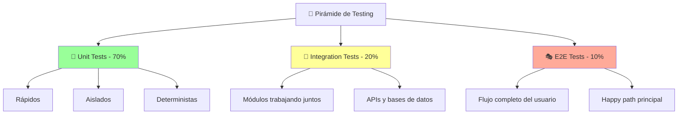

#### ✅ Características de Buenos Tests

##### 1. **F.I.R.S.T. Principles**

| Principio | Descripción | Ejemplo |
|-----------|-------------|---------|
| **🚀 Fast** | Ejecutan rápidamente | < 1ms por unit test |
| **🔒 Independent** | No dependen entre sí | Pueden ejecutarse en cualquier orden |
| **🔄 Repeatable** | Mismo resultado siempre | Sin dependencias externas |
| **✅ Self-Validating** | Pass o Fail claramente | Asserts explícitos |
| **⏰ Timely** | Escritos just-in-time | TDD o inmediatamente después |

##### 2. **AAA Pattern (Arrange-Act-Assert)**

```typescript
// ✅ Test bien estructurado con AAA
describe('UserService', () => {
    it('should create user with valid data', () => {
        // 🔧 ARRANGE - Preparar datos y mocks
        const userData = {
            email: 'test@example.com',
            password: 'securePassword123',
            name: 'John Doe'
        };
        const mockRepository = {
            create: jest.fn().mockResolvedValue({ id: '123', ...userData })
        };
        const userService = new UserService(mockRepository);

        // ⚡ ACT - Ejecutar la acción a testear
        const result = await userService.createUser(userData);

        // ✅ ASSERT - Verificar el resultado
        expect(result).toEqual({
            id: '123',
            email: 'test@example.com',
            name: 'John Doe'
        });
        expect(mockRepository.create).toHaveBeenCalledWith(userData);
    });
});
```

##### 3. **Test Names que Cuentan Historias**

```typescript
// ❌ Nombres poco descriptivos
it('test user creation');
it('should work');
it('test validation');

// ✅ Nombres que describen comportamiento
describe('UserService.createUser', () => {
    it('should create user successfully with valid email and password');
    it('should throw ValidationError when email is missing');
    it('should throw ValidationError when email format is invalid');
    it('should throw ValidationError when password is shorter than 8 characters');
    it('should hash password before storing in repository');
    it('should assign default role when no role is specified');
});
```

#### 🚨 Test Smells y Cómo Evitarlos

##### 1. **Tests Frágiles**

```typescript
// ❌ Test frágil - depende de implementación interna
it('should process order', () => {
    const order = new Order();
    order.addItem('item1', 10);
    
    // Depende del orden interno de llamadas
    expect(order.items[0].name).toBe('item1');
    expect(order.items[0].price).toBe(10);
    expect(order.calculateTotal()).toBe(10);
});

// ✅ Test robusto - se enfoca en comportamiento
it('should calculate total correctly when items are added', () => {
    const order = new Order();
    
    order.addItem('item1', 10);
    order.addItem('item2', 20);
    
    expect(order.getTotal()).toBe(30);
    expect(order.getItemCount()).toBe(2);
});
```

##### 2. **Tests Lentos**

```typescript
// ❌ Test lento - usa base de datos real
it('should save user to database', async () => {
    const user = new User('test@example.com');
    await realDatabase.save(user); // 🐌 Lento
    
    const savedUser = await realDatabase.findById(user.id);
    expect(savedUser.email).toBe('test@example.com');
});

// ✅ Test rápido - usa mock
it('should save user using repository', async () => {
    const mockRepository = {
        save: jest.fn().mockResolvedValue({ id: '123' })
    };
    const userService = new UserService(mockRepository);
    
    const user = new User('test@example.com');
    await userService.save(user);
    
    expect(mockRepository.save).toHaveBeenCalledWith(user);
});
```

#### 🎭 Test Doubles (Mocks, Stubs, Fakes)

```typescript
// 🎯 STUB - Respuesta predefinida
const userRepositoryStub = {
    findById: () => Promise.resolve({ id: '123', name: 'John' })
};

// 🕵️ MOCK - Verificar interacciones
const userRepositoryMock = {
    save: jest.fn(),
    findById: jest.fn()
};

// 🏗️ FAKE - Implementación simplificada funcional
class FakeUserRepository {
    private users: User[] = [];
    
    save(user: User): Promise<User> {
        this.users.push(user);
        return Promise.resolve(user);
    }
    
    findById(id: string): Promise<User | null> {
        return Promise.resolve(
            this.users.find(u => u.id === id) || null
        );
    }
}
```

#### 📈 Métricas de Calidad de Tests

##### **Code Coverage Guidelines**

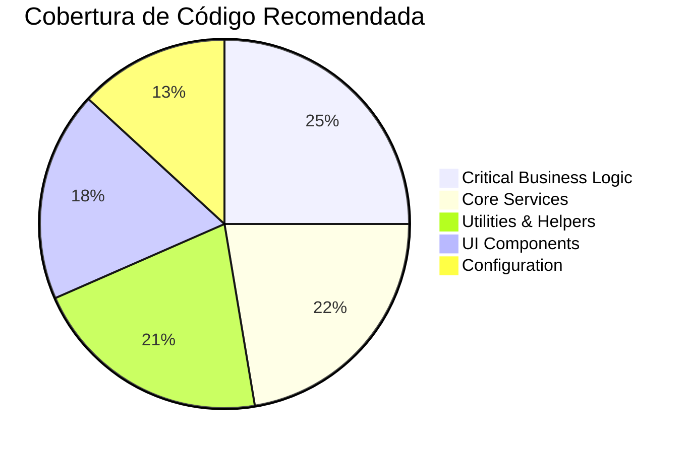

| Tipo de Código | Cobertura Mínima | Justificación |
|----------------|------------------|---------------|
| **Business Logic** | 95%+ | Crítico para el negocio |
| **Services & APIs** | 85%+ | Integraciones importantes |
| **Utilities** | 80%+ | Reutilizados en muchos lugares |
| **UI Components** | 70%+ | Menos lógica, más presentación |
| **Config/Constants** | 50%+ | Bajo riesgo de cambio |

##### **Mutation Testing**

```typescript
// Ejemplo: Mutation testing encuentra este bug
function calculateDiscount(price: number, percentage: number): number {
    // Bug: >= debería ser >
    return price >= 100 ? price * (percentage / 100) : 0;
}

// Test que pasa pero no detecta el bug
it('should apply discount for expensive items', () => {
    expect(calculateDiscount(150, 10)).toBe(15);
});

// Test de mutation que encuentra el bug
it('should not apply discount for items exactly at threshold', () => {
    expect(calculateDiscount(100, 10)).toBe(0); // Este test fallaría con >=
});
```

#### 🔧 TDD (Test-Driven Development)

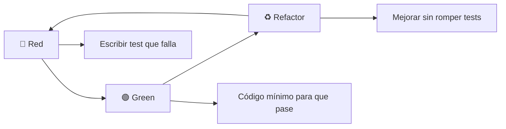

**Ejemplo de TDD Cycle**:

```typescript
// 🔴 RED - Test que falla
describe('Calculator', () => {
    it('should add two numbers', () => {
        const calculator = new Calculator();
        expect(calculator.add(2, 3)).toBe(5);
    });
});

// 🟢 GREEN - Implementación mínima
class Calculator {
    add(a: number, b: number): number {
        return 5; // ¡Hardcoded para que pase!
    }
}

// 🔴 RED - Más tests para forzar generalización
it('should add different numbers', () => {
    const calculator = new Calculator();
    expect(calculator.add(1, 1)).toBe(2);
    expect(calculator.add(0, 0)).toBe(0);
});

// 🟢 GREEN - Implementación real
class Calculator {
    add(a: number, b: number): number {
        return a + b; // Ahora sí es la implementación correcta
    }
}

// ♻️ REFACTOR - Mejorar sin romper
class Calculator {
    add(a: number, b: number): number {
        this.validateNumbers(a, b);
        return a + b;
    }
    
    private validateNumbers(...numbers: number[]): void {
        if (numbers.some(n => typeof n !== 'number')) {
            throw new Error('All arguments must be numbers');
        }
    }
}
```

---

## 🏗️ SECCIÓN IV: Arquitectura y Patrones

### 🎯 Clean Architecture

> **"The goal of software architecture is to minimize the human resources required to build and maintain the required system"**  
> — *Robert C. Martin*

Clean Architecture nos ayuda a crear sistemas que son:
- 🧪 **Testeable**
- 🔧 **Mantenible**  
- 🔄 **Flexible**
- 🚀 **Escalable**

#### 🔄 Dependency Rule

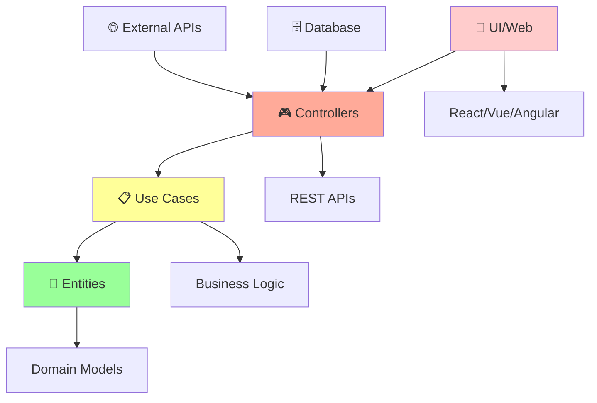

**Regla Fundamental**: Las dependencias solo pueden apuntar **hacia adentro**. El código en un círculo interno no debe saber nada sobre los círculos externos.

#### 🏛️ Capas de Clean Architecture

##### 🏢 1. Entities (Núcleo del Dominio)

```typescript
// ✅ Entity - Lógica de negocio pura
class User {
    private constructor(
        private readonly id: UserId,
        private email: Email,
        private readonly createdAt: Date
    ) {}

    static create(email: string): User {
        return new User(
            UserId.generate(),
            Email.create(email),
            new Date()
        );
    }

    changeEmail(newEmail: string): void {
        const email = Email.create(newEmail);
        
        // Regla de negocio: No se puede cambiar email más de una vez por día
        if (this.wasEmailChangedToday()) {
            throw new DomainError('Email can only be changed once per day');
        }
        
        this.email = email;
    }

    private wasEmailChangedToday(): boolean {
        // Lógica de dominio pura
        return false; // Implementación simplificada
    }
}
```

##### 📋 2. Use Cases (Casos de Uso)

```typescript
// ✅ Use Case - Orquesta la lógica de negocio
class ChangeUserEmailUseCase {
    constructor(
        private userRepository: UserRepository,
        private emailService: EmailService
    ) {}

    async execute(userId: string, newEmail: string): Promise<void> {
        // 1. Obtener usuario
        const user = await this.userRepository.findById(userId);
        if (!user) {
            throw new Error('User not found');
        }

        // 2. Aplicar regla de negocio
        const oldEmail = user.getEmail();
        user.changeEmail(newEmail);

        // 3. Persistir cambios
        await this.userRepository.save(user);

        // 4. Notificar cambio
        await this.emailService.sendEmailChangeNotification(oldEmail, newEmail);
    }
}
```

##### 🎮 3. Controllers (Interfaz)

```typescript
// ✅ Controller - Adapta requests a use cases
class UserController {
    constructor(private changeEmailUseCase: ChangeUserEmailUseCase) {}

    async changeEmail(req: Request, res: Response): Promise<void> {
        try {
            const { userId } = req.params;
            const { email } = req.body;

            // Validación de entrada
            if (!email || !this.isValidEmail(email)) {
                res.status(400).json({ error: 'Invalid email format' });
                return;
            }

            // Ejecutar caso de uso
            await this.changeEmailUseCase.execute(userId, email);

            res.status(200).json({ message: 'Email updated successfully' });
        } catch (error) {
            if (error instanceof DomainError) {
                res.status(400).json({ error: error.message });
            } else {
                res.status(500).json({ error: 'Internal server error' });
            }
        }
    }

    private isValidEmail(email: string): boolean {
        return /^[^\s@]+@[^\s@]+\.[^\s@]+$/.test(email);
    }
}
```

#### 🔧 Dependency Injection

```typescript
// ✅ Container de dependencias
class Container {
    private static instance: Container;
    private dependencies = new Map();

    static getInstance(): Container {
        if (!Container.instance) {
            Container.instance = new Container();
        }
        return Container.instance;
    }

    register<T>(token: string, factory: () => T): void {
        this.dependencies.set(token, factory);
    }

    resolve<T>(token: string): T {
        const factory = this.dependencies.get(token);
        if (!factory) {
            throw new Error(`Dependency ${token} not found`);
        }
        return factory();
    }
}

// ✅ Configuración de dependencias
function setupDependencies(): void {
    const container = Container.getInstance();
    
    // Infraestructura
    container.register('userRepository', () => new DatabaseUserRepository());
    container.register('emailService', () => new SMTPEmailService());
    
    // Use Cases
    container.register('changeEmailUseCase', () => 
        new ChangeUserEmailUseCase(
            container.resolve('userRepository'),
            container.resolve('emailService')
        )
    );
    
    // Controllers
    container.register('userController', () =>
        new UserController(container.resolve('changeEmailUseCase'))
    );
}
```

---

## 🎨 SECCIÓN V: Patrones de Diseño Esenciales

### 🏭 Repository Pattern

> **Propósito**: Encapsular la lógica necesaria para acceder a las fuentes de datos.

```typescript
// ✅ Interfaz del repositorio (en la capa de dominio)
interface UserRepository {
    findById(id: string): Promise<User | null>;
    findByEmail(email: string): Promise<User | null>;
    save(user: User): Promise<void>;
    delete(id: string): Promise<void>;
}

// ✅ Implementación concreta (en la capa de infraestructura)
class DatabaseUserRepository implements UserRepository {
    constructor(private database: Database) {}

    async findById(id: string): Promise<User | null> {
        const userData = await this.database.query(
            'SELECT * FROM users WHERE id = ?', 
            [id]
        );
        return userData ? User.fromDatabase(userData) : null;
    }

    async save(user: User): Promise<void> {
        const userData = user.toDatabaseFormat();
        await this.database.query(
            'INSERT INTO users (id, email, created_at) VALUES (?, ?, ?) ON DUPLICATE KEY UPDATE email = VALUES(email)',
            [userData.id, userData.email, userData.createdAt]
        );
    }
}

// ✅ Mock para testing
class InMemoryUserRepository implements UserRepository {
    private users: Map<string, User> = new Map();

    async findById(id: string): Promise<User | null> {
        return this.users.get(id) || null;
    }

    async save(user: User): Promise<void> {
        this.users.set(user.getId(), user);
    }
}
```

### 🏗️ Factory Pattern

```typescript
// ✅ Factory para crear diferentes tipos de usuarios
class UserFactory {
    static createAdminUser(email: string): User {
        const user = User.create(email);
        user.assignRole(Role.ADMIN);
        user.grantAllPermissions();
        return user;
    }

    static createRegularUser(email: string): User {
        const user = User.create(email);
        user.assignRole(Role.USER);
        user.grantBasicPermissions();
        return user;
    }

    static createGuestUser(): User {
        const user = User.create('guest@temporary.com');
        user.assignRole(Role.GUEST);
        user.setAsTemporary();
        return user;
    }
}

// ✅ Abstract Factory para diferentes entornos
abstract class RepositoryFactory {
    abstract createUserRepository(): UserRepository;
    abstract createProductRepository(): ProductRepository;
}

class DatabaseRepositoryFactory extends RepositoryFactory {
    createUserRepository(): UserRepository {
        return new DatabaseUserRepository(new PostgreSQLConnection());
    }

    createProductRepository(): ProductRepository {
        return new DatabaseProductRepository(new PostgreSQLConnection());
    }
}

class TestRepositoryFactory extends RepositoryFactory {
    createUserRepository(): UserRepository {
        return new InMemoryUserRepository();
    }

    createProductRepository(): ProductRepository {
        return new InMemoryProductRepository();
    }
}
```

### 🎯 Strategy Pattern

```typescript
// ✅ Strategy para diferentes métodos de pago
interface PaymentStrategy {
    processPayment(amount: number, paymentData: PaymentData): Promise<PaymentResult>;
}

class CreditCardPaymentStrategy implements PaymentStrategy {
    async processPayment(amount: number, paymentData: CreditCardData): Promise<PaymentResult> {
        // Lógica específica para tarjeta de crédito
        const isValid = this.validateCreditCard(paymentData);
        if (!isValid) {
            throw new PaymentError('Invalid credit card');
        }
        
        return await this.chargeCreditCard(amount, paymentData);
    }

    private validateCreditCard(data: CreditCardData): boolean {
        return data.number.length === 16 && data.cvv.length === 3;
    }
}

class PayPalPaymentStrategy implements PaymentStrategy {
    async processPayment(amount: number, paymentData: PayPalData): Promise<PaymentResult> {
        // Lógica específica para PayPal
        return await this.processPayPalPayment(amount, paymentData);
    }
}

// ✅ Context que usa las estrategias
class PaymentProcessor {
    private strategy: PaymentStrategy;

    constructor(strategy: PaymentStrategy) {
        this.strategy = strategy;
    }

    setStrategy(strategy: PaymentStrategy): void {
        this.strategy = strategy;
    }

    async processPayment(amount: number, paymentData: PaymentData): Promise<PaymentResult> {
        return await this.strategy.processPayment(amount, paymentData);
    }
}

// ✅ Uso
const processor = new PaymentProcessor(new CreditCardPaymentStrategy());
await processor.processPayment(100, creditCardData);

processor.setStrategy(new PayPalPaymentStrategy());
await processor.processPayment(100, paypalData);
```

### 👁️ Observer Pattern

```typescript
// ✅ Observer pattern para eventos de dominio
interface DomainEvent {
    occurredOn: Date;
    eventType: string;
}

class UserEmailChangedEvent implements DomainEvent {
    constructor(
        public readonly userId: string,
        public readonly oldEmail: string,
        public readonly newEmail: string,
        public readonly occurredOn: Date = new Date()
    ) {}

    get eventType(): string {
        return 'UserEmailChanged';
    }
}

interface EventHandler<T extends DomainEvent> {
    handle(event: T): Promise<void>;
}

class EmailChangeNotificationHandler implements EventHandler<UserEmailChangedEvent> {
    constructor(private emailService: EmailService) {}

    async handle(event: UserEmailChangedEvent): Promise<void> {
        await this.emailService.sendEmailChangeNotification(
            event.oldEmail,
            event.newEmail
        );
    }
}

class SecurityAlertHandler implements EventHandler<UserEmailChangedEvent> {
    constructor(private securityService: SecurityService) {}

    async handle(event: UserEmailChangedEvent): Promise<void> {
        await this.securityService.logSecurityEvent(
            event.userId,
            'EMAIL_CHANGE',
            event.occurredOn
        );
    }
}

// ✅ Event Bus
class EventBus {
    private handlers = new Map<string, EventHandler<any>[]>();

    subscribe<T extends DomainEvent>(eventType: string, handler: EventHandler<T>): void {
        if (!this.handlers.has(eventType)) {
            this.handlers.set(eventType, []);
        }
        this.handlers.get(eventType)!.push(handler);
    }

    async publish<T extends DomainEvent>(event: T): Promise<void> {
        const handlers = this.handlers.get(event.eventType) || [];
        await Promise.all(handlers.map(handler => handler.handle(event)));
    }
}
```
